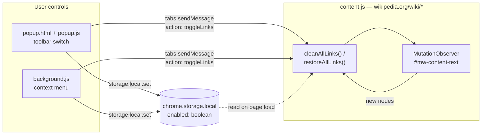

# Wikipedia Link Cleaner

[](https://github.com/YakupEmreYerli/Wiki-Cleaner/actions/workflows/ci.yml)
[](LICENSE)
[](https://addons.mozilla.org/firefox/addon/wiki-cleaner/)
[](manifest.json)
[](manifest.json)
[](manifest.json)
[](package.json)

A browser extension that turns internal Wikipedia links into unclickable plain text
and hides citation markers, so reading an article stops feeling like resisting
"just one more tab".

It uses Manifest V3, and a single package is declared to run in both Firefox and
Chrome.

> 🇹🇷 Türkçe sürüm: [README.md](README.md)

## What it does

| Behaviour | Implementation |
| --- | --- |
| Neutralises internal links | For `a[href^="/wiki/"]` inside `#mw-content-text`, the `href` attribute is removed and preserved in `data-original-href` |
| Makes them look like text | The link gets `color: inherit`, `text-decoration: none`, `cursor: text` and the `wp-link-cleaned` class |
| Blocks clicks | An `onclick` handler calling `preventDefault` is attached |
| Hides citation markers | A `<style id="wp-link-cleaner-styles">` is injected with `.reference { display: none !important; }` |
| Catches late content | A `MutationObserver` watches `#mw-content-text` with `childList` + `subtree` |
| Remembers the preference | State lives in the `enabled` boolean in `chrome.storage.local`, defaulting to `true` |
| Restores cleanly | `href`, the page's own inline style, the class and `onclick` are all reverted |

### What it leaves alone

Cleaning is scoped to `#mw-content-text`, so the sidebar, top navigation and page
footer are out of range by construction. Inside the article body, links under any
of these selectors are skipped:

`.reference` · `.mw-editsection` · `.infobox` · `sup` · `table`

That keeps footnote links, "edit" links, infoboxes and navigation tables
(including `table.navbox`) working. External links and in-page anchors (`#section`)
are never considered, because they do not start with `/wiki/`.

## Architecture



Three moving parts:

1. **`content.js`** reads `enabled` from `chrome.storage.local` on page load. If the
   value is not `false`, it cleans the article and starts the observer.
2. **`popup.js`** writes the switch state to storage, then sends a `toggleLinks`
   message to the *active* tab.
3. **`background.js`** creates the context menu on install, seeds the default
   state, and on click flips the state and messages the *clicked* tab.

## Installation

### Firefox

Published on AMO:
**[addons.mozilla.org/firefox/addon/wiki-cleaner](https://addons.mozilla.org/firefox/addon/wiki-cleaner/)**

### Chrome

Not published on the Chrome Web Store yet. Until then, enable **Developer mode**
on `chrome://extensions` and use **Load unpacked** on the project directory.

### Developer install (Firefox)

1. Open `about:debugging` in Firefox.
2. Choose **This Firefox** in the left menu.
3. Click **Load Temporary Add-on…**.
4. Pick the `manifest.json` file in the project directory.

Temporary add-ons are removed when Firefox restarts. Run `npm run build` to
produce a packaged `.zip` under `web-ext-artifacts/`.

## Development

```bash
npm install
```

| Command | What it does |
| --- | --- |
| `npm test` | Runs the unit tests with `node:test` + `jsdom` (33 tests) |
| `npm run lint` | Validates the add-on with `web-ext lint`, treating warnings as errors |
| `npm run build` | Produces a distributable `.zip` in `web-ext-artifacts/` |
| `npm run icons` | Re-renders the PNG icons from `icons/*.svg` (requires `librsvg`) |
| `npm audit --audit-level=critical` | Audits the development dependencies |

The tests back the `chrome.*` APIs with a narrow stub in `test/helpers.js` and load
the real `popup.html`, which also verifies the `toggle-status` contract between the
markup and the script. See [CONTRIBUTING.md](CONTRIBUTING.md) for details.

CI runs the tests on Node 22/24 for every push and pull request, then runs
`web-ext lint` and the dependency audit; if both pass it builds the package and
uploads it as an artifact.

## Known limits

- **The background is declared twice.** The manifest follows MDN's cross-browser
  recipe: Chrome uses `background.service_worker`, Firefox uses
  `background.scripts`. Mozilla's validator therefore emits
  `BACKGROUND_SERVICE_WORKER_IGNORED`; because that warning is expected, it is
  allowlisted by name in `tools/lint-extension.mjs`.
- **Toggling reaches one tab.** Both the panel and the context menu message a
  single tab. Other open Wikipedia tabs keep their previous state until reloaded,
  even though the stored preference updates immediately.
- **Citation hiding is broad.** The injected style hides every `.reference` element
  on the page, including the back-links in the "References" section.

## Privacy

The add-on makes no network requests, collects no data and loads no remote code.
The only thing it stores is the `enabled` preference, and it never leaves the
device. See [SECURITY.md](SECURITY.md).

## Project layout

```
manifest.json      Add-on definition, permissions and Firefox target
content.js         DOM work: neutralise/restore plus the MutationObserver
background.js      Context menu and default-state setup
popup.html         Markup and styling for the toolbar panel
popup.js           State handling for the panel switch
icons/icon.svg     Icon source (32 px and up)
icons/icon-small.svg  Simplified source for 16 px
icons/*.png        16/32/48/96/128 px icons rendered from the SVGs
tools/render-icons.sh  Script that renders the icon PNGs
web-ext-config.mjs Development files kept out of the package
test/              node:test + jsdom unit tests
```

## License

[MIT](LICENSE) © Yakup Emre Yerli
