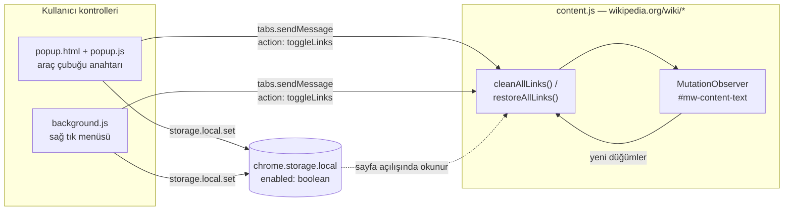

# Wikipedia Link Cleaner

[](https://github.com/YakupEmreYerli/Wiki-Cleaner/actions/workflows/ci.yml)
[](LICENSE)
[](manifest.json)
[](manifest.json)
[](package.json)

Wikipedia makalelerindeki dahili bağlantıları tıklanamaz düz metne çeviren ve atıf
işaretlerini gizleyen Firefox eklentisi. Amaç, okurken her mavi kelimenin yarattığı
"bir tık daha" dürtüsünü ortadan kaldırmak.

> 🇬🇧 English version: [README.en.md](README.en.md)

## Ne yapar?

| Davranış | Uygulama |
| --- | --- |
| Dahili bağlantıları nötrleştirir | `#mw-content-text` içindeki `a[href^="/wiki/"]` bağlantılarının `href` özniteliği kaldırılır, orijinali `data-original-href` içinde saklanır |
| Görünümü metne yaklaştırır | Bağlantıya `color: inherit`, `text-decoration: none`, `cursor: text` uygulanır ve `wp-link-cleaned` sınıfı eklenir |
| Tıklamayı engeller | Nötrleştirilen bağlantıya `preventDefault` yapan bir `onclick` bağlanır |
| Atıf işaretlerini gizler | `#wp-link-cleaner-styles` kimlikli bir `<style>` enjekte edilir: `.reference { display: none !important; }` |
| Sonradan gelen içeriği yakalar | `#mw-content-text` üzerinde `childList` + `subtree` dinleyen bir `MutationObserver` çalışır |
| Tercihi hatırlar | Durum `chrome.storage.local` içindeki `enabled` boolean'ında tutulur, varsayılanı `true` |
| Geri alır | `href`, sayfanın kendi satır içi stili, sınıf ve `onclick` ilk hâline döndürülür |

### Dokunulmayan alanlar

Temizleme yalnızca `#mw-content-text` içinde çalışır; kenar çubuğu, üst menü ve
sayfa altı navigasyonu zaten kapsam dışıdır. Makale gövdesinin içinde ise şu
seçicilerden birinin altında kalan bağlantılar atlanır:

`.reference` · `.mw-editsection` · `.infobox` · `sup` · `table`

Böylece dipnot bağlantıları, "düzenle" bağlantıları, bilgi kutuları ve gezinme
tabloları (`table.navbox` dâhil) çalışır durumda kalır. Dış bağlantılar ve sayfa
içi çapa bağlantıları (`#bolum`) `/wiki/` ön ekiyle başlamadıkları için hiç
değerlendirilmez.

## Mimari



Akış üç parçadan oluşur:

1. **`content.js`** sayfa yüklenince `chrome.storage.local` içindeki `enabled`
   değerini okur. Değer `false` değilse temizlemeyi uygular ve gözlemciyi başlatır.
2. **`popup.js`** anahtarın durumunu depoya yazar, ardından *etkin sekmeye*
   `toggleLinks` mesajı gönderir.
3. **`background.js`** kurulumda sağ tık menüsünü oluşturur, varsayılan durumu
   yazar ve menü tıklamasında durumu tersine çevirip *tıklanan sekmeye* mesaj yollar.

## Kurulum

Eklenti henüz AMO'da yayınlanmadığı için geliştirici modunda yüklenir:

1. Firefox'ta adres çubuğuna `about:debugging` yaz.
2. Sol menüden **This Firefox** (Bu Firefox) seçeneğine tıkla.
3. **Load Temporary Add-on…** düğmesine bas.
4. Proje dizinindeki `manifest.json` dosyasını seç.

Geçici eklentiler Firefox kapatılınca kaldırılır. Paketlenmiş bir `.zip` üretmek
için `npm run build` kullan; çıktı `web-ext-artifacts/` altına düşer.

## Geliştirme

```bash
npm install
```

| Komut | Ne yapar |
| --- | --- |
| `npm test` | `node:test` + `jsdom` ile birim testlerini çalıştırır (33 test) |
| `npm run lint` | `web-ext lint` ile eklentiyi doğrular, uyarıları hata sayar |
| `npm run build` | Yayına hazır `.zip` paketini `web-ext-artifacts/` altında üretir |
| `npm run icons` | `icons/*.svg` kaynaklarından PNG simgeleri yeniden üretir (`librsvg` gerekir) |
| `npm audit --audit-level=critical` | Geliştirme bağımlılıklarını denetler |

Testler `chrome.*` API'lerini `test/helpers.js` içindeki dar bir sahte nesneyle
karşılar ve gerçek `popup.html` dosyasını yükler; böylece HTML ile betik
arasındaki `toggle-status` sözleşmesi de doğrulanır. Ayrıntılar için
[CONTRIBUTING.md](CONTRIBUTING.md).

CI her push ve pull request'te Node 22/24 üzerinde testleri, ardından
`web-ext lint` ve bağımlılık denetimini çalıştırır; ikisi de geçerse paketi üretip
artefakt olarak yükler.

## Bilinen sınırlar

- **Yalnızca Firefox.** Paket Manifest V2 kullanır (`background.scripts`,
  `browser_action`) ve `browser_specific_settings.gecko` ile Firefox 142.0+
  hedefler. Güncel Chrome sürümleri bu manifest'i yüklemez.
- **Açık/kapa yalnızca bir sekmeye ulaşır.** Hem panel hem sağ tık menüsü mesajı
  tek bir sekmeye gönderir. Aynı anda açık diğer Wikipedia sekmeleri yenilenene
  kadar eski durumlarını korur; depodaki tercih ise hemen güncellenir.
- **Atıf gizleme geniş kapsamlıdır.** Enjekte edilen stil, sayfadaki tüm
  `.reference` elemanlarını gizler — bunlara "Kaynakça" bölümündeki geri
  bağlantılar da dâhildir.

## Gizlilik

Eklenti ağ isteği yapmaz, veri toplamaz ve uzaktan kod yüklemez. Sakladığı tek
şey `enabled` tercihidir ve cihazdan çıkmaz. Ayrıntılar için [SECURITY.md](SECURITY.md).

## Dosya yapısı

```
manifest.json      Eklenti tanımı, izinler ve Firefox hedefi
content.js         DOM manipülasyonu, nötrleştirme/geri alma, MutationObserver
background.js      Sağ tık menüsü ve varsayılan durum kurulumu
popup.html         Araç çubuğu panelinin işaretlemesi ve stili
popup.js           Panel anahtarının durum yönetimi
icons/icon.svg     Simgenin kaynağı (32 piksel ve üstü)
icons/icon-small.svg  16 piksel için sadeleştirilmiş kaynak
icons/*.png        SVG'lerden üretilen 16/32/48/96/128 piksel simgeler
tools/render-icons.sh  Simge PNG'lerini üreten betik
web-ext-config.mjs Paket dışında kalacak geliştirme dosyalarının listesi
test/              node:test + jsdom birim testleri
```

## Lisans

[MIT](LICENSE) © Yakup Emre Yerli
