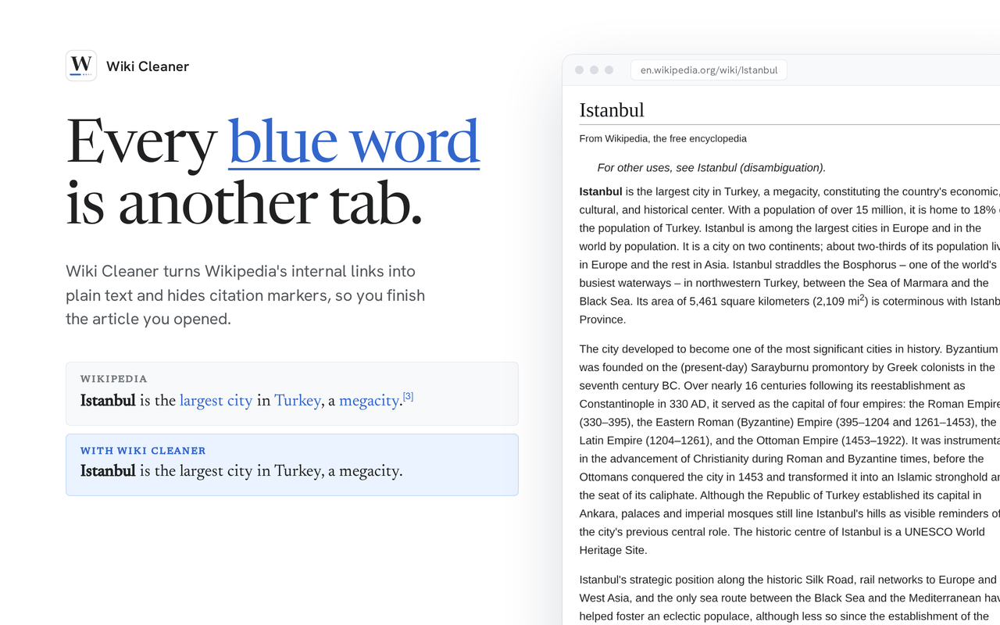
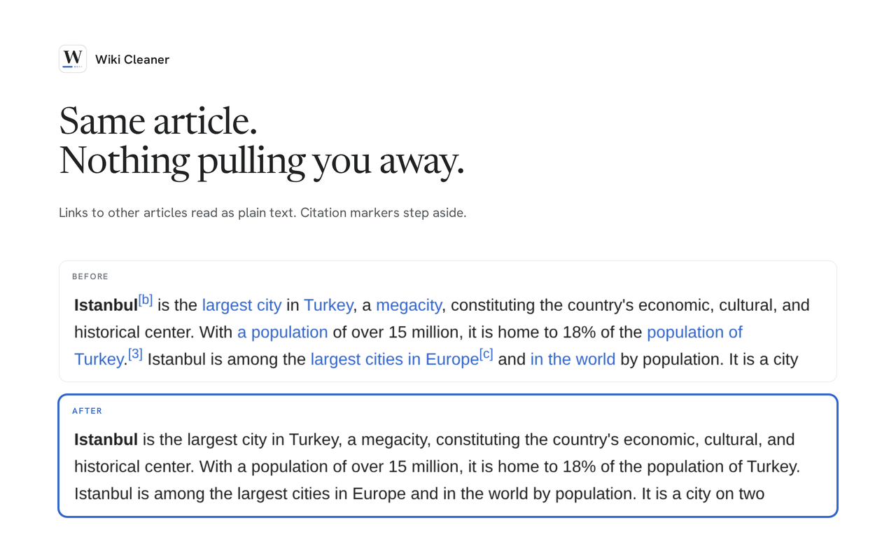

#  Wiki Cleaner

[](https://addons.mozilla.org/firefox/addon/wiki-cleaner/) [](https://addons.mozilla.org/firefox/addon/wiki-cleaner/) [](https://github.com/YakupEmreYerli/Wiki-Cleaner/actions/workflows/ci.yml) [](LICENSE)

Every blue word in a Wikipedia article is an invitation to open one more tab. Wiki Cleaner is a Firefox extension that turns Wikipedia's internal links into plain text and hides citation markers, so the article you opened is the article you finish.

> Türkçe: [README.tr.md](README.tr.md)

<a href="https://addons.mozilla.org/firefox/addon/wiki-cleaner/"></a>



It reads nothing and sends nothing: no network requests, no data collection, no remote code. The only thing it stores is whether it is switched on. Every release is tested, signed by Mozilla and published by CI from a tagged commit.

## Features

- **Plain text, not links.** Links to other articles on the same Wikipedia become ordinary text — same colour, no underline, no click. Switch it off and every link comes back exactly as it was.
- **Citation markers step aside.** `[1]`, `[2]` and friends are hidden while you read.
- **The useful parts keep working.** Infoboxes, navigation tables, footnotes, "edit" links, external links and links to other language editions are left alone.
- **Keeps up with the page.** Content Wikipedia loads after the page opens is cleaned too.
- **One switch.** Turn it off from the toolbar button or by right-clicking any article; the choice is remembered.
- **Every language edition.** Works on any `*.wikipedia.org` article; the interface follows your browser in English or Turkish.



## Install

| Where | How |
| --- | --- |
| Firefox 142+ | [Firefox Add-ons](https://addons.mozilla.org/firefox/addon/wiki-cleaner/) — updates automatically |
| Signed `.xpi` | [Releases](https://github.com/YakupEmreYerli/Wiki-Cleaner/releases/latest) — drag the file onto a Firefox window |
| Chrome 120+ | Not in the Chrome Web Store. Clone the repository, open `chrome://extensions`, enable **Developer mode** and choose **Load unpacked** |

## Privacy

The extension asks for two permissions: `storage`, for the on/off switch, and `contextMenus`, for the right-click item. It runs only on `*.wikipedia.org/wiki/*` pages, never contacts a server and declares no data collection to Mozilla. Details and how to report a vulnerability: [SECURITY.md](SECURITY.md).

## Documentation

| Page | What it covers |
| --- | --- |
| [How it works](docs/how-it-works.md) | What exactly is changed and left alone, the architecture, known limits, project layout |
| [Changelog](CHANGELOG.md) | Every release |
| [Brand kit](docs/brand/README.md) | Logo, colours, typefaces and voice |
| [Contributing](CONTRIBUTING.md) | Setting up, the rules a pull request has to follow |

## Development

```bash
git clone https://github.com/YakupEmreYerli/Wiki-Cleaner.git && cd Wiki-Cleaner
npm install
npm test          # node:test + jsdom, no browser needed
npm run lint      # web-ext lint; any warning not on the allowlist fails
npm run build     # unsigned package in web-ext-artifacts/
```

To try a change, open `about:debugging` → **This Firefox** → **Load Temporary Add-on…** and pick `manifest.json`. Icons are rendered from `icons/*.svg` with `npm run icons` (needs `librsvg`).

Releases are cut by pushing a `vX.Y.Z` tag that matches `manifest.json` and has a section in `CHANGELOG.md`: CI runs the tests and lint, submits the version to Firefox Add-ons, waits for Mozilla's signature and only then publishes the GitHub release with the signed `.xpi`.

## License

MIT — see [LICENSE](LICENSE). The logo's W is drawn from [Newsreader](https://fonts.google.com/specimen/Newsreader) (SIL Open Font License 1.1).
