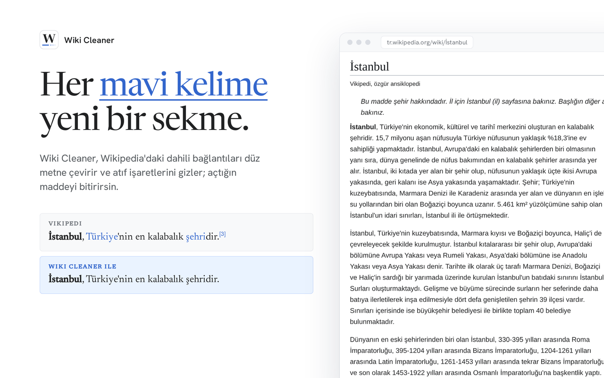
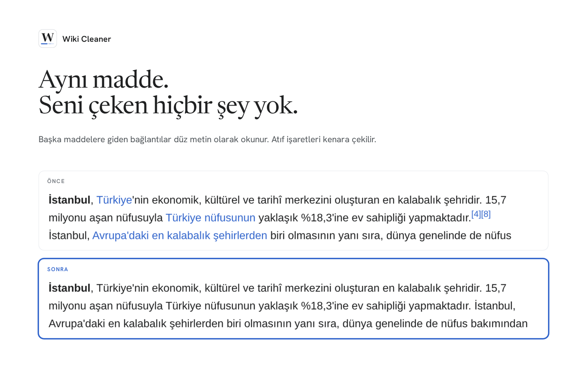

#  Wiki Cleaner

[](https://addons.mozilla.org/tr/firefox/addon/wiki-cleaner/) [](https://addons.mozilla.org/tr/firefox/addon/wiki-cleaner/) [](https://github.com/YakupEmreYerli/Wiki-Cleaner/actions/workflows/ci.yml) [](LICENSE)

Bir Wikipedia maddesindeki her mavi kelime bir sekme daha açmaya davettir. Wiki Cleaner, Wikipedia'daki dahili bağlantıları düz metne çeviren ve atıf işaretlerini gizleyen bir Firefox eklentisi; açtığın maddeyi bitirirsin.

> English: [README.md](README.md)

<a href="https://addons.mozilla.org/tr/firefox/addon/wiki-cleaner/"></a>



Hiçbir şey okumaz, hiçbir şey göndermez: ağ isteği yok, veri toplama yok, uzaktan kod yok. Sakladığı tek şey açık olup olmadığı. Her sürüm test edilir, Mozilla tarafından imzalanır ve etiketli bir commit'ten CI ile yayımlanır.

## Özellikler

- **Bağlantı değil, düz metin.** Aynı Wikipedia'daki başka maddelere giden bağlantılar sıradan metne döner: aynı renk, alt çizgi yok, tıklama yok. Kapattığında her bağlantı eski hâline birebir döner.
- **Atıf işaretleri kenara çekilir.** `[1]`, `[2]` gibi işaretler okurken gizlenir.
- **İşe yarayan kısımlar çalışmaya devam eder.** Bilgi kutuları, gezinme tabloları, dipnotlar, "değiştir" bağlantıları, dış bağlantılar ve başka dil sürümlerine giden bağlantılar olduğu gibi kalır.
- **Sayfaya ayak uydurur.** Wikipedia'nın sayfa açıldıktan sonra yüklediği içerik de temizlenir.
- **Tek anahtar.** Araç çubuğu düğmesinden ya da maddeye sağ tıklayarak kapatırsın; tercih hatırlanır.
- **Her dil sürümünde.** Tüm `*.wikipedia.org` maddelerinde çalışır; arayüz tarayıcının diline göre Türkçe ya da İngilizce.



## Kurulum

| Nereden | Nasıl |
| --- | --- |
| Firefox 142+ | [Firefox Eklentileri](https://addons.mozilla.org/tr/firefox/addon/wiki-cleaner/) — kendiliğinden güncellenir |
| İmzalı `.xpi` | [Sürümler](https://github.com/YakupEmreYerli/Wiki-Cleaner/releases/latest) — dosyayı bir Firefox penceresine sürükle |
| Chrome 120+ | Chrome Web Mağazası'nda yok. Depoyu klonla, `chrome://extensions` sayfasında **Geliştirici modu**nu aç ve **Paketlenmemiş öğe yükle**'yi seç |

## Gizlilik

Eklenti iki izin ister: açık/kapalı anahtarı için `storage`, sağ tık öğesi için `contextMenus`. Yalnızca `*.wikipedia.org/wiki/*` sayfalarında çalışır, hiçbir sunucuya bağlanmaz ve Mozilla'ya veri toplamadığını beyan eder. Ayrıntılar ve güvenlik açığı bildirimi: [SECURITY.md](SECURITY.md).

## Belgeler

| Sayfa | Ne anlatır |
| --- | --- |
| [Nasıl çalışır](docs/how-it-works.md) | Tam olarak neyi değiştirdiği ve neye dokunmadığı, mimari, bilinen sınırlar, dosya yapısı (İngilizce) |
| [Değişiklik günlüğü](CHANGELOG.md) | Bütün sürümler (İngilizce) |
| [Marka kiti](docs/brand/README.md) | Logo, renkler, yazı tipleri, dil |
| [Katkı rehberi](CONTRIBUTING.md) | Ortamı kurma, bir pull request'in uyması gereken kurallar |

## Geliştirme

```bash
git clone https://github.com/YakupEmreYerli/Wiki-Cleaner.git && cd Wiki-Cleaner
npm install
npm test          # node:test + jsdom, tarayıcı gerekmez
npm run lint      # web-ext lint; izin listesinde olmayan her uyarı hata sayılır
npm run build     # imzasız Firefox paketi, web-ext-artifacts/ altına
npm run build:chromium  # Chrome / Edge mağaza paketi
```

Bir değişikliği denemek için `about:debugging` → **Bu Firefox** → **Geçici Eklenti Yükle…** ile `manifest.json`'u seç. Simgeler `icons/*.svg` kaynaklarından `npm run icons` ile üretilir (`librsvg` gerekir).

Sürüm, `manifest.json` ile aynı ve `CHANGELOG.md`'de bölümü olan bir `vX.Y.Z` etiketi itilerek çıkar: CI testleri ve lint'i çalıştırır, sürümü Firefox Eklentileri'ne gönderir, Mozilla'nın imzasını bekler ve ancak ondan sonra imzalı `.xpi` ile GitHub sürümünü açar.

## Lisans

MIT — bkz. [LICENSE](LICENSE). Logodaki W, [Newsreader](https://fonts.google.com/specimen/Newsreader) yazı tipinden çizildi (SIL Open Font License 1.1).
