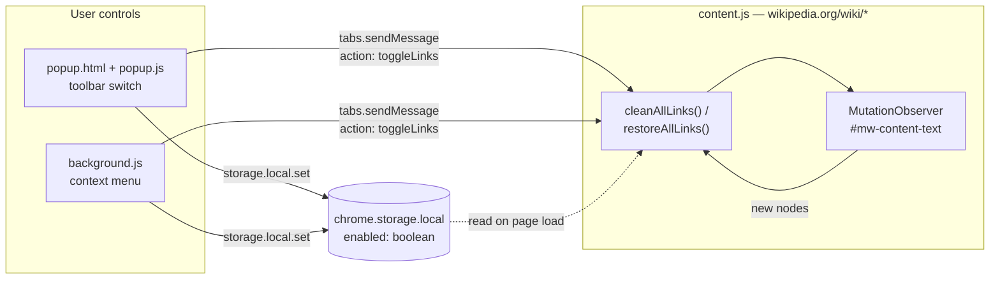

# How Wiki Cleaner works

The whole extension is three small scripts and one stored boolean. This page is the
reference behind the [README](../README.md); every claim here is checked by the tests in
`test/`.

## What it changes

| Behaviour | Implementation |
| --- | --- |
| Neutralises internal links | Inside `#mw-content-text`, links that resolve to a `/wiki/` page on the same Wikipedia host (`/wiki/X`, `./X` or `https://en.wikipedia.org/wiki/X`) lose their `href` attribute, which is preserved in `data-original-href` |
| Makes them look like text | The link gets `color: inherit`, `text-decoration: none`, `cursor: text` and the `wp-link-cleaned` class |
| Blocks clicks | An `onclick` handler calling `preventDefault` is attached |
| Hides citation markers | A `<style id="wp-link-cleaner-styles">` is injected with `.reference { display: none !important; }` |
| Catches late content | A `MutationObserver` watches `#mw-content-text` with `childList` + `subtree` |
| Remembers the preference | State lives in the `enabled` boolean in `chrome.storage.local`, defaulting to `true` |
| Restores cleanly | `href`, the page's own inline style, the class and `onclick` are all reverted |

## What it leaves alone

Cleaning is scoped to `#mw-content-text`, so the sidebar, top navigation and page
footer are out of range by construction. Inside the article body, links under any
of these selectors are skipped:

`.reference` · `.mw-editsection` · `.infobox` · `sup` · `table`

That keeps footnote links, "edit" links, infoboxes and navigation tables
(including `table.navbox`) working. External links, other-language Wikipedia pages,
non-article addresses such as `/w/index.php` and in-page anchors (`#section`) are
never considered.

## Architecture



Three moving parts:

1. **`content.js`** reads `enabled` from `chrome.storage.local` on page load. If the
   value is not `false`, it cleans the article and starts the observer.
2. **`popup.js`** writes the switch state to storage, then sends a `toggleLinks`
   message to the *active* tab.
3. **`background.js`** creates the context menu on install, seeds the default
   state, and on click flips the state and messages the *clicked* tab.

## Known limits

- **The background is declared twice.** The manifest follows MDN's cross-browser
  recipe: Chrome uses `background.service_worker`, Firefox uses
  `background.scripts`. Mozilla's validator therefore emits
  `BACKGROUND_SERVICE_WORKER_IGNORED`; because that warning is expected, it is
  allowlisted by name in `tools/lint-extension.mjs`.
- **Toggling reaches one tab.** Both the panel and the context menu message a
  single tab. Other open Wikipedia tabs keep their previous state until reloaded,
  even though the stored preference updates immediately.
- **Citation hiding is broad.** The injected style hides every `.reference` element
  on the page, including the back-links in the "References" section.

## Project layout

```
README.md          Overview (English); README.tr.md is the Turkish version
CHANGELOG.md       Release notes, read by the release workflow
manifest.json      Add-on definition, permissions and Firefox target
content.js         DOM work: neutralise/restore plus the MutationObserver
background.js      Context menu and default-state setup
popup.html         Markup and styling for the toolbar panel
popup.js           State handling for the panel switch and text translation
_locales/          Turkish (tr) and English (en, default) interface strings
icons/icon.svg     Icon source (32 px and up)
icons/icon-small.svg  Simplified source for 16 px
icons/*.png        16/32/48/96/128 px icons rendered from the SVGs
tools/render-icons.sh  Script that renders the icon PNGs
web-ext-config.mjs Development files kept out of the package
test/              node:test + jsdom unit tests
docs/how-it-works.md  This page
docs/store/        Store and README images, TR and EN (not packaged)
docs/brand/        Brand kit: logo, colours, typefaces (not packaged)
```
